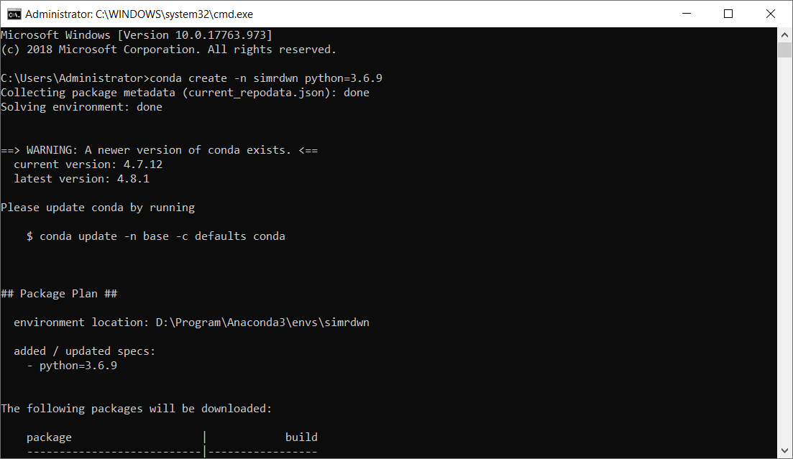
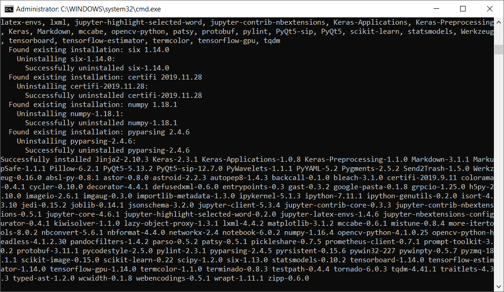
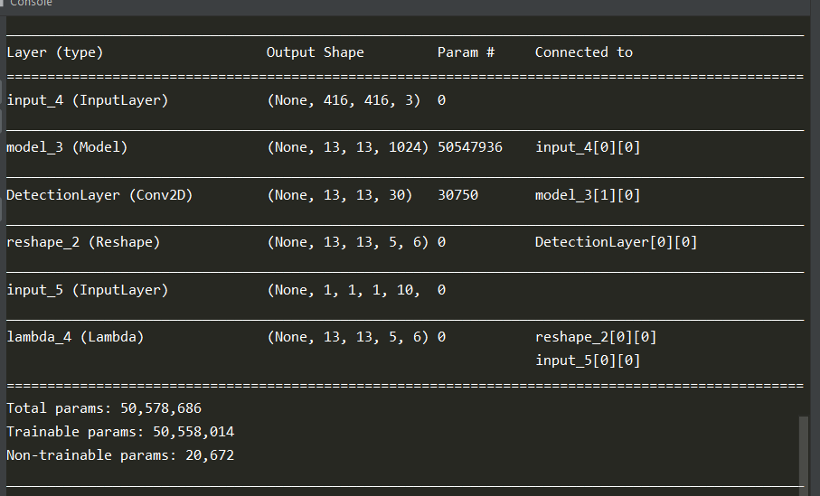
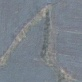
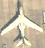
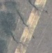
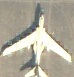
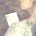
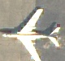

# Cài đặt môi trường

- Cài đặt Cuda toolkit 10.0; cudnn=7.4.1; anaconda

- Tạo một môi trường anaconda có tên là 'simrdwn' với python phiên bản 3.6.9:

    `conda create -n simrdwn python=3.6.9`
    
    

- Cài đặt các package python cần thiết:

    `activate simrdwn`

    `pip install -r requirement.txt`
    
    


# Huấn luyện mạng nơ-ron
## Chuẩn bị dữ liệu

- Dữ liệu được đưa vào gồm 2 folder *images* chứa các ảnh và *label_voc* chứa các file .xml tương ứng với nhãn của từng ảnh được lưu dưới dạng **VOC fomat**

- Chỉnh sửa file `config_plane.json` với mục `train_image_folder` và `train_annot_folder` chỉ đến đúng đường dẫn ở tương ứng trên máy tính giống như sau

```python
{
    "model" : {
        "backend":              "Full Yolo",
        "input_size":           416,
        "anchors":              [0.53,0.51, 0.92,0.69, 1.36,1.67, 1.62,1.55, 1.83,1.84],
        "max_box_per_image":    5,
        "labels":               ["plane"]
    },

    "train": {
        "train_image_folder":   "./plane/images/",
        "train_annot_folder":   "./plane/labels_voc/",

        "train_times":          8,
        "pretrained_weights":   "",
        "batch_size":           16,
        "learning_rate":        1e-4,
        "nb_epochs":            50,
        "warmup_epochs":        3,

        "object_scale":         5.0 ,
        "no_object_scale":      1.0,
        "coord_scale":          1.0,
        "class_scale":          1.0,

        "saved_weights_name":   "full_yolo_plane.h5",
        "debug":                true
    },

    "valid": {
        "valid_image_folder":   "",
        "valid_annot_folder":   "",

        "valid_times":          1
    }
}
```
- Tạo các hệ số anchors box tương ứng với bộ dataset bằng cách chạy câu lệnh

    `python gen_anchors.py -c config_plane.json`

    copy các hệ số tính toán được để điền vào mục *anchors* tương ứng trong file `config_plane.json` 

## Huấn luyện mô hình mạng phát hiện đối tượng

- Bắt đầu quá trình huấn luyện bằng cách chạy câu lệnh

    `python train.py -c config_plane.json`

    + Với *train_times* trong file `config_plane.json` là số lần huấn luyện.

    + *saved_weights_name* trong file `config_plane.json` là tên file trọng số sẽ được lưu lại.  


- Kiến trúc mạng sử dụng là mạng **Fully YOLO** với input kích thước input là *( 416 x 416 )* và output là *( 13 x 13 x 5 x ( numClass + 5))*

    
    
    Code xây dựng mạng bằng **Keras**
```python
    # Layer 1
    x = Conv2D(32, (3,3), strides=(1,1), padding='same', name='conv_1', use_bias=False)(input_image)
    x = BatchNormalization(name='norm_1')(x)
    x = LeakyReLU(alpha=0.1)(x)
    x = MaxPooling2D(pool_size=(2, 2))(x)

    # Layer 2
    x = Conv2D(64, (3,3), strides=(1,1), padding='same', name='conv_2', use_bias=False)(x)
    x = BatchNormalization(name='norm_2')(x)
    x = LeakyReLU(alpha=0.1)(x)
    x = MaxPooling2D(pool_size=(2, 2))(x)

    # Layer 3
    x = Conv2D(128, (3,3), strides=(1,1), padding='same', name='conv_3', use_bias=False)(x)
    x = BatchNormalization(name='norm_3')(x)
    x = LeakyReLU(alpha=0.1)(x)

    # Layer 4
    x = Conv2D(64, (1,1), strides=(1,1), padding='same', name='conv_4', use_bias=False)(x)
    x = BatchNormalization(name='norm_4')(x)
    x = LeakyReLU(alpha=0.1)(x)

    # Layer 5
    x = Conv2D(128, (3,3), strides=(1,1), padding='same', name='conv_5', use_bias=False)(x)
    x = BatchNormalization(name='norm_5')(x)
    x = LeakyReLU(alpha=0.1)(x)
    x = MaxPooling2D(pool_size=(2, 2))(x)

    # Layer 6
    x = Conv2D(256, (3,3), strides=(1,1), padding='same', name='conv_6', use_bias=False)(x)
    x = BatchNormalization(name='norm_6')(x)
    x = LeakyReLU(alpha=0.1)(x)

    # Layer 7
    x = Conv2D(128, (1,1), strides=(1,1), padding='same', name='conv_7', use_bias=False)(x)
    x = BatchNormalization(name='norm_7')(x)
    x = LeakyReLU(alpha=0.1)(x)

    # Layer 8
    x = Conv2D(256, (3,3), strides=(1,1), padding='same', name='conv_8', use_bias=False)(x)
    x = BatchNormalization(name='norm_8')(x)
    x = LeakyReLU(alpha=0.1)(x)
    x = MaxPooling2D(pool_size=(2, 2))(x)

    # Layer 9
    x = Conv2D(512, (3,3), strides=(1,1), padding='same', name='conv_9', use_bias=False)(x)
    x = BatchNormalization(name='norm_9')(x)
    x = LeakyReLU(alpha=0.1)(x)

    # Layer 10
    x = Conv2D(256, (1,1), strides=(1,1), padding='same', name='conv_10', use_bias=False)(x)
    x = BatchNormalization(name='norm_10')(x)
    x = LeakyReLU(alpha=0.1)(x)

    # Layer 11
    x = Conv2D(512, (3,3), strides=(1,1), padding='same', name='conv_11', use_bias=False)(x)
    x = BatchNormalization(name='norm_11')(x)
    x = LeakyReLU(alpha=0.1)(x)

    # Layer 12
    x = Conv2D(256, (1,1), strides=(1,1), padding='same', name='conv_12', use_bias=False)(x)
    x = BatchNormalization(name='norm_12')(x)
    x = LeakyReLU(alpha=0.1)(x)

    # Layer 13
    x = Conv2D(512, (3,3), strides=(1,1), padding='same', name='conv_13', use_bias=False)(x)
    x = BatchNormalization(name='norm_13')(x)
    x = LeakyReLU(alpha=0.1)(x)

    skip_connection = x

    x = MaxPooling2D(pool_size=(2, 2))(x)

    # Layer 14
    x = Conv2D(1024, (3,3), strides=(1,1), padding='same', name='conv_14', use_bias=False)(x)
    x = BatchNormalization(name='norm_14')(x)
    x = LeakyReLU(alpha=0.1)(x)

    # Layer 15
    x = Conv2D(512, (1,1), strides=(1,1), padding='same', name='conv_15', use_bias=False)(x)
    x = BatchNormalization(name='norm_15')(x)
    x = LeakyReLU(alpha=0.1)(x)

    # Layer 16
    x = Conv2D(1024, (3,3), strides=(1,1), padding='same', name='conv_16', use_bias=False)(x)
    x = BatchNormalization(name='norm_16')(x)
    x = LeakyReLU(alpha=0.1)(x)

    # Layer 17
    x = Conv2D(512, (1,1), strides=(1,1), padding='same', name='conv_17', use_bias=False)(x)
    x = BatchNormalization(name='norm_17')(x)
    x = LeakyReLU(alpha=0.1)(x)

    # Layer 18
    x = Conv2D(1024, (3,3), strides=(1,1), padding='same', name='conv_18', use_bias=False)(x)
    x = BatchNormalization(name='norm_18')(x)
    x = LeakyReLU(alpha=0.1)(x)

    # Layer 19
    x = Conv2D(1024, (3,3), strides=(1,1), padding='same', name='conv_19', use_bias=False)(x)
    x = BatchNormalization(name='norm_19')(x)
    x = LeakyReLU(alpha=0.1)(x)

    # Layer 20
    x = Conv2D(1024, (3,3), strides=(1,1), padding='same', name='conv_20', use_bias=False)(x)
    x = BatchNormalization(name='norm_20')(x)
    x = LeakyReLU(alpha=0.1)(x)

    # Layer 21
    skip_connection = Conv2D(64, (1,1), strides=(1,1), padding='same', name='conv_21', use_bias=False)(skip_connection)
    skip_connection = BatchNormalization(name='norm_21')(skip_connection)
    skip_connection = LeakyReLU(alpha=0.1)(skip_connection)
    skip_connection = Lambda(space_to_depth_x2)(skip_connection)

    x = concatenate([skip_connection, x])

    # Layer 22
    x = Conv2D(1024, (3,3), strides=(1,1), padding='same', name='conv_22', use_bias=False)(x)
    x = BatchNormalization(name='norm_22')(x)
    x = LeakyReLU(alpha=0.1)(x)
```
- Với bộ dataset tương ứng với ảnh máy bay( chỉ có 1 class) quá trình huấn luyện sẽ là quá trình *finetuning* từ file trọng số đã có trước( dowload tại <a href="https://drive.google.com/drive/folders/1NQ5ok8gX6XBpeRCoT7PgO8QNKCyQUO8q?usp=sharing">đây</a>)


## Huấn luyện mô hình phân lớp đối tượng

    Do một số hạn chế nên các vùng phát hiện có đối tượng ở phần trên có thể bị nhận nhầm. Để giảm triệt để số lượng vùng phát hiện nhầm, cần phải xây dựng một mạng nơ-ron nữa để phân biệt những vùng phát hiện được có đội tượng vào vùng không có đối tượng

<p style="text-align: center" ><i>Một số hình ảnh về vùng bị nhận nhầm</i></p> 
<table width = "100%" style = "border: 0px solid white">
    <tr >
        <td width="50%" style = "border: 0px solid white"> 
           <p style="text-align: center" >Không có máy bay</p>
        </td>
        <td width="50%" style = "border: 0px solid white">
            <p style="text-align: center" >Có máy bay</p>
        </td>
    </tr>
    
   <tr >
        <td width="50%" style = "border: 0px solid white"> 
            
<!--             <p style="text-align: center" >Demo abc</p> -->
        </td>
        <td width="50%" style = "border: 0px solid white">
            
        </td>
    </tr>
    <tr >
        <td width="50%" style = "border: 0px solid white"> 
            
        </td>
        <td width="50%" style = "border: 0px solid white">
            
        </td>
    </tr>
    <tr >
        <td width="50%" style = "border: 0px solid white"> 
            
        </td>
        <td width="50%" style = "border: 0px solid white">
            
        </td>
    </tr>
</table> 

- Cách thức huấn luyện mạng phân lớp đối tượng

    + Các vùng phát hiện được ở mạng detection ở trên sẽ được lưu lại vào phân loại thủ công vào 2 folder `plane` và `noPlane`
    + Một mạng nơ-ron nhỏ sẽ được xây dựng để nhận đầu vào là ảnh *( 80 x 80 )* đầu ra là *1 hoặc 0*( tương ứng với *có* và *không có* máy bay)

        ```python
        model.add(Conv2D(32, (2, 2), input_shape=input_shape))
        model.add(Activation('relu'))
        model.add(MaxPooling2D(pool_size=(2, 2)))

        model.add(Conv2D(32, (2, 2)))
        model.add(Activation('relu'))
        model.add(MaxPooling2D(pool_size=(2, 2)))

        model.add(Conv2D(64, (2, 2)))
        model.add(Activation('relu'))
        model.add(MaxPooling2D(pool_size=(2, 2)))

        model.add(Flatten())
        model.add(Dense(64))
        model.add(Activation('relu'))
        model.add(Dropout(0.5))
        model.add(Dense(1))
        model.add(Activation('sigmoid'))
        ```
    + Bắt đầu quá trình huấn luyện bằng cách chạy câu lệnh

        `python trainClass.py`
        
    + Kết thúc quá trình huấn luyện ta thu được file `classModel.h5` sẽ chứa trọng số của mạng phân lớp.

# Ứng dụng phát hiện đối tượng

- Bảo đảm rằng các file `config_plane.json`, `full_yolo_plane.h5` và `classModel.h5` nằm trong folder chứa source trước khi chạy.
- Mở ứng dụng bằng cách chạy câu lệnh

    `python run.py`

- Vào tab ` phát hiện đối tượng `, click chọn ` Chọn thư mục ảnh test` để mở folder chứa ảnh test


- click chọn ` Phát hiện đối tượng ` để bắt đầu quá trình phát hiện sẽ thực hiện qua các bước

    + Load lại các mạng nơ-ron để phát hiện đối tượng từ file trọng số *.h5* đã được lưu lại trước đó

            yolo.load_weights('full_yolo_plane.h5')
            classModel = load_model('model_saved1.h5')

    + Chia ảnh lớn thành các mẩu nhỏ kích thước *(544 x 544)* bằng cách trượt các cửa sổ có kích thước `WINDOW_SIZE = (544, 544)` với khoảng cách giữa 2 cửa số là `STRIDE = 408`( tương đương 2 cứa sổ cạnh nhau sẽ chồng lấp lên nhau khoảng 20% ). Công đoạn này được gói gọn trong hàm `sliding_window`

    + Đưa từng mẩu ảnh nhỏ qua mạng detection ta được các boxes có khả năng là có đối tượng máy bay:

            boxes = yolo.predict(image,obj_threshold=obj_threshold)

    + Với mỗi box phát hiện được ta đưa qua mạng phân lớp để xác định xem box đó có đúng là chứa máy bay không nếu đúng thì ta lưu vùng này lại:

            preImg= img[srcYmin:srcYmax,srcXmin:srcXmax]
            preImg=cv2.resize(preImg,(80,80))
            input = np.expand_dims(preImg, axis=0)
            if classModel.predict(input)[0] == 1:
                listRects.append((srcXmin , srcXmax, srcYmin, srcYmax))

- Kết quả ảnh đã phát hiện vùng có máy bay sẽ được hiển thị lên cửa sổ pyplot với vùng đóng khung xanh lục là vùng chứa máy bay


    

    